# Songhai Fan

**Study things. Build tools. Play with ideas.**

My background is in human–computer interaction and information visualisation. I build tools for developers and explore how people interact with AI and data.

[Website](https://songhai.site)

## Frank Study

Research and thinking about human–computer interaction, information visualisation, and visual storytelling.

&nbsp;
  &nbsp;
  &nbsp;
  &nbsp;
  &nbsp;
  

[Perspectiva](https://github.com/SonghaiFan/perspectiva) · [Access](https://github.com/SonghaiFan/access)

## Franklin Tools

Open-source tools for building, understanding, and working with software.

&nbsp;
  &nbsp;
  &nbsp;
  &nbsp;
  &nbsp;
  &nbsp;
  

[REA](https://github.com/SonghaiFan/rea) · [Franklin Comments](https://github.com/SonghaiFan/franklin-comments) · [Obsidian Blog Publisher](https://github.com/SonghaiFan/obsidian-blog-publisher)

## Frankie Play

Experiments with AI, interaction, and everyday play.

<a href="https://songhaifan.github.io/frankie-brain/">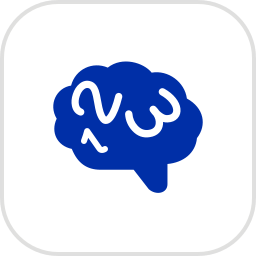</a> &nbsp; <a href="https://songhaifan.github.io/frankie-brain-ios/">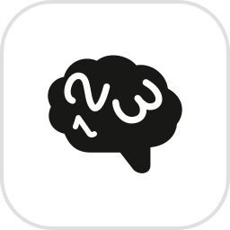</a> &nbsp; <a href="https://songhaifan.github.io/frankie-cards/">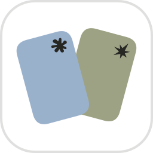</a> &nbsp; <a href="https://songhaifan.github.io/frankie-dictionary/">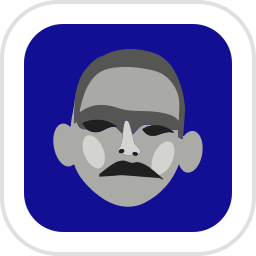</a> &nbsp; <a href="https://songhaifan.github.io/frankie-generative-art/">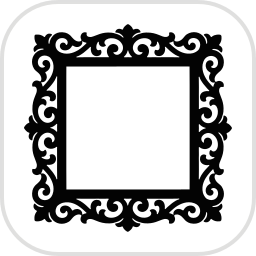</a> &nbsp; <a href="https://songhaifan.github.io/frankie-goal/">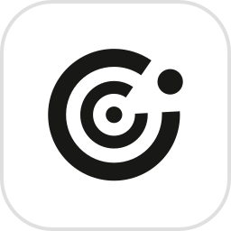</a> &nbsp; <a href="https://songhaifan.github.io/frankie-guitar/">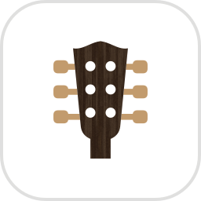</a> &nbsp;  &nbsp; <a href="https://songhaifan.github.io/frankie-mbti/">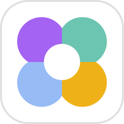</a> &nbsp; <a href="https://songhaifan.github.io/frankie-onitama/">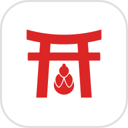</a> &nbsp; <a href="https://songhaifan.github.io/frankie-poker/">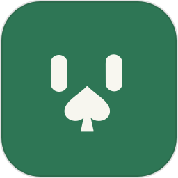</a> &nbsp; <a href="https://songhaifan.github.io/frankie-stocks/">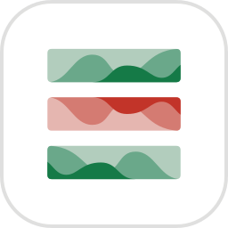</a> &nbsp; <a href="https://songhaifan.github.io/frankie-tarot/">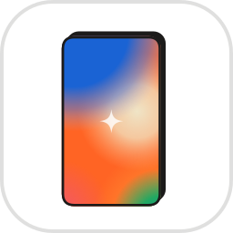</a> &nbsp; <a href="https://songhaifan.github.io/frankie-werewolf/">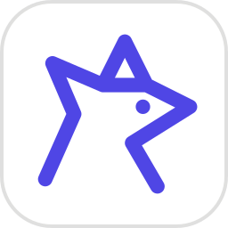</a>

[Tarot API](https://songhaifan.github.io/frankie-tarot-api/) · [OWSPACE Archive](https://songhaifan.github.io/frankie-owspace-api/)

---

These projects will remain free and open source forever. A star is the biggest encouragement for me to keep building.
